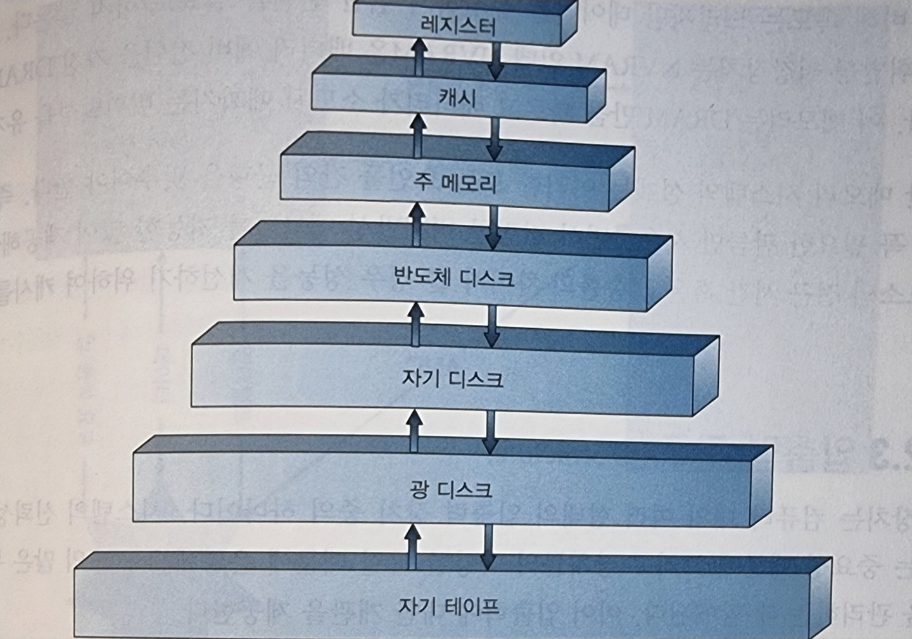

# Chapter 1. 서론

## 1.1 운영체제가 할 일

### # **사용자의 관점**

- `개인컴퓨터`: 사용자 편이성을 위해 설계되고, 자원의 이용(성농)에는 전혀 싱경쓰지 않는다. 다수 사용자의 요구보다는 한 사용자가 사용하기에 작합하도록 최적화하였다.
- `터미널서버`: 대형,미니 컴퓨터에 연결된 터미널 환경이다. 동일한 컴퓨터를 다른 터미널에서 접근하기 때문에 자원을 공유하며 정보를 교환할 수 있고, 자원 이용을 극대화하도록 설계되었다. 각 개인이 정당한 몫만 사용할 수 있다.
- `워크스테이션`: **워크스테이션**과 **서버**로 구성된 네트워크에 연결된 워크스테이션이다. 사용자들은 자신이 맘대로 할 수 있는 전용 자원을 갖지만 네트워킹과 파일, 계산 및 프린트 서버와 같은 서버를 공유한다. 따라서 개인의 사용 편이성과 자원 이용 간에 적절한 조화를 이루도록 설계되었다.

사용자의 관점이 존재하지 않거나 매우 적은 경우:

- 가전제품이나 자동차 내의 내장형 컴퓨터 - 숫자 키패드를 가지고, 상태를 표시하기 위해 표시등을 켜고 끌 수 있지만 이돌 컴퓨터나 운영체제는 사용자의 개입 없이 작동하도록 설계

### # **시스템의 관점**

- `자원할당자`: cpu시간, 메모리 공간, 저장 공간, 입출력 장치 등의 자원을 관리하는 관리자로서 동작한다. 요청을 효율적으로 관리하기 위해 자원을 어디에 할당할지 결정한다.
- `제어프로그램`: 오류와 컴퓨터의 부적절한 사용을 방지하기 위해 사용자 프로그램의 실행을 제어한다. 특히, 사용자 프로그램이 실행하는 입출력 장치의 연산과 제어와 깊이 관여한다.

### # **운영체제의 정의**

운영체제에 대한 명확한 정의는 존재하지 않고, 어느 부분이 운영체제에 속하고 어느 부분이 속하지 않는 지에 대해 보편적으로 인정되는 정의 또한 존재하지 않는다.

→ 순수 하드웨어만으로 사용이 어렵고, 이 때문에 응용프로그램이 개발되었음.
→ 이들 다양한 프로그램들은 입출력 장치의 제어와 같은 공통적인 연산이 필요.
→ 여기에 자원을 제어하고 할당하는 공통 기능을 하나의 소프트웨어로 통합한 것이 **운영체제**.

- `커널(kernel)`: 컴퓨터에서 항상 실행되는 하나의 프로그램
- `시스템프로그램`: 운영체제에는 연관되어 있으나 커널에 포함될 필요가 없는 프로그램
- `응용프로그램`: 시스템의 작동과 관계없이 모든 프로그램을 포함

## 1.2 컴퓨터 시스템의 구성

### # **컴퓨터 시스템 연산**

**부트스트랩 프로그램(Bootstrap Program)**

- 컴퓨터를 구동시키기 위한 초기 프로그램이다.
- 읽기 전용 메모리인 ROM이나 EEPROM에 저장되고 펌웨어라고 알려져 있다.
- 시스템의 모든 기능을 초기화한다.
- 커널을 찾아 메모리를 적재하고 실행한다.

**시스템 프로세스, 시스템 데몬**

커널이 아닌 시스템 프로그램에 의해 제공되는 서비스이다.
부트 시에 메모리에 적재되어 커널이 실행되는 동안 실행한다.
이 단계가 끝나면 완전히 부트가 된 상태로 시스템은 사건(events)이 발생하기를 기다린다.

**인터럽트(Interrupt)**

앞서 언급된 사건(events)을 발생시키는 역할을 한다.

- `하드웨어 인터럽트`: 어느 때든지 시스템 버스를 통해 CPU에 신호를 보내 인터럽트 발생 가능
- `소프트웨어 인터럽트`: 시스템 호출이라 불리는 연산을 실행하여 인터럽트 발생 가능

**인터럽트 작동 방식**

> 인터럽트 발생 → 하던 일을 중단하고 즉시 지정된 위치로 실행 위치를 이동 → 인터럽트 서비스 루틴 실행 → 인터럽트 되었던 연산 재개

핸들러의 주소를 저장한 포인터 테이블을 이용하여 빠른 처리속도를 제공한다. 이에따라 사용 가능한 인터럽트의 개수가 정해져 있다.

인터럽트를 서비스한 후 중단되었던 연산을 재시작하기 위해 중단된 명령의 주소를 저장한다.

### # **저장장치 구조**

- `ROM`: 읽기 전용 메모리. 부투스트랩 프로그램과 같은 정적 프로그램 저장
- `EEPROM`: 전기적으로 소거 가능한 프로그램 가능-읽기 전용 메모리. 대부분 정적 프로그램을 저장 (ex. 스마트폰 초기 프로그램)
- `메인 메모리(RAM)`: 재기록 가능한 메모리로, CPU는 RAM에서 명령어를 가져와 프로그램을 실행. **휘발성**
- `하드 디스크(HDD)`: 가장 일반적인 보조 장치로 프로그램과 데이터 모두를 저장할 수 있음. **비휘발성**

위로 갈수록 비싸지만 빠르고, 아래로 갈수록 싸지만 느리다. (주 메모리부터는 휘발성 메모리)

**반도체 디스크 (SSD)**

일반적으로 하드 디스크보다 빠르며 비휘발성 메모리이다.

- `Flash Memory`: 가장 일반적인 형태의 SSD. DRAM보다 느리지만 데이터 저장을 위해 전원을 필요로 하지 않는다.

<aside>

💡 **적재와 저장**
적재: 메인 메모리로부터 CPU 내부의 레지스터로 한 바이트 또는 한 워드를 옮기는 것이다.
저장: 레지스터의 내용을 메인 메모리로 이동한다.

</aside>

<aside>

💡 **휘발성 vs 비휘발성**
휘발성: 전원이 제거되면 저장하고 있는 내용이 사라짐. 속도가 빠르지만 데이터 보관이 어렵다.
비휘발성: 전원이 제거되어도 저장 데이터를 유지. 휘밝성에 비해 속도가 느리고 가격이 싸다.

</aside>

### # **입출력 구조**

- `장치 제어기`: 장치에 존재한다. 자신이 제어하는 주변 장치와 자신의 로컬 버퍼 저장장치 사이의 데이터를 운영체제에 전달한다.
- `정치 드라이버`: 운영체제에 존재한다. 통상적으로 각 장치 제어기마다 드라이버를 가지며, 장치 제어기의 동작을 이해하고 운영체제의 다른 부분들에게 장치에 대한 일관된 인터페이스를 제공한다.

**입출력 순서**

1. 디바이스 드라이버는 장치 제어기의 적절한 레지스터에 필요한 값을 적재
2. 장치 제어기는 이어 해야 할 동작을 결정하기 위해 레지스터의 내용을 조사
3. 제어기는 장치로부터 자신의 로컬 버퍼로 데이터 전송을 시작
4. 전송이 완료되면 장치 제어기는 자신이 연산을 완료했음을 인터럽트를 이용하여 디바이스 드라이버에게 통보
5. 디바이스 드라이버는 제어를 운영체제에게 반환 (입력 완료인 경우 데이터 또는 데이터에 대한 포인터를 같이 반환)

**직접 메모리 접근 (DMA)**

`직접 메모리 접근(DMA)`는 위와 같은 인터럽트 구동 방식의 입출력이 대량의 데이터를 전송하는 데에 높은 오버헤드를 초래하여, 이 문제를 해결하기 위하여 사용되는 장치이다.

DMA 특징

- 장치 제어기는 CPU의 개입 없이 메모리로부터 자신의 버퍼 장치롤 또는 버퍼로부터 메모리로 데이터 블록을 전송한다.
- 바이트 단위로 인터럽트가 발생하는 것이 아니라 블록 단위로 인터럽트 발생한다.
- 장치 제어기가 전송 작업을 실행하는 동안 CPU는 다른 작업 수행 가능하다.

## 1.3 컴퓨터의 시스템 구조

### **# 단일 처리기 시스템**

하나의 주 CPU로 이루어진 시스템이다.

디스크, 키보드, 그래픽 제어기 등 다양한 처리기의 형태로 제공된다. (범용적)

### **# 다중 처리기 시스템**

밀접한 통신을 하는 둘 이상의 CPU로 이루어진 시스템이다.

컴퓨터 버스, 클록, 메모리와 주변 장치를 공유하며, 서버에서 주로 사용하였으나, 이후 데스크톱, 렙톱 및 스마트폰 시스템으로 이동했다.

**다중 처리기 장점**

- **증가된 처리량**: 짧은 시간 동안 더욱 많은 일을 수행 (단, N개의 처리기를 사용한다고 N배가 되지는 않음)
- **규모의 경제**: 동일한 개수의 단일 처리기와 비교해 시스템 구성 비용이 저렴함 (주변 장치, 저장장치 등을 공유하기 때문)
- **증가된 신뢰성**: 하나의 처리기가 고장나더라도 시스템이 정지하지 않고 속도만 느려짐. (우아한 퇴보, 결함 허용)

**비대칭적 다중 처리 (AMP)**

- 하나의 메인 처리기 아래로 여러 개의 처리기가 주종관계로 관리된다.
- 메인 처리기는 시스템을 제어한다.
- 종속 처리기들은 메인 처리기의 명령을 실행하거나 미리 지정된 테스크를 실행한다.

**대칭적 다중 처리 (SMP)**

- 각 처리기가 모든 작업을 처리할 수 있다. (주종 관계 X)
- 하나의 CPU가 과다하게 일하는 경우가 생길 수 있다. (프로세스와 자원을 동적으로 공유햐여 해결 할 수 있음)
- 대부분의 OS에서 SMP를 지원한다.

**멀티코어**

- 하나의 칩에 여러개의 코어를 포함시키는 것이다.
- 단일 코어를 가진 여러 개의 칩보다 효율적이다. (칩 내의 통신이 칩 사이의 통신보다 빠르기 때문)

**블레이드 서버**

- 여러개의 처리기 보드와 입출력 보드, 네트워킹 보드들이 하나의 새시(틀) 안에 장착되는 형태이다.
- 다중 처리기와 달리 각 블레이드-처리기 보드는 독립적으로 부팅될 수 있고 자기 자신의 운영체제를 실행한다.
- 여러 독립적인 다중 처리기 시스템으로 구성된다.

### **# 클러스터형 시스템**

여러 CPU를 가진 시스템으로 `다중 처리기`와 다르게 프로세스가 아닌 시스템 또는 노드들을 연결하여 구성 (약결합)

- 각 노드는 단일 처리기 또는 멀티코어 시스템일 수 있다.
- 저장장치를 공유하고 LAN으로 연결된다.
- 최근에는 SAN(Storage-Area Network)을 통해 수 킬로미터 떨어진 클러스터 노드들을 지원하기도 한다.

**클러스터링 사용 목적**

- 높은 가용성, 클러스터 내 하나 이상의 컴퓨터가 고장 나더라도 서비스는 계속 제공된다.
- 각 노드는 다른 노드들을 감시하고, 해당 노드가 고장 나면 감시하던 노드가 고장 난 노드의 저장장치에 대한 소유권을 넘겨받고 실행 중이던 응용프로그램을 다시 시작한다.

**비대칭형 클러스터링**

- 컴퓨터 한대는 **긴급 대기 모드**를 유지하여 활성 서버들을 감시하는 작업만 수행한다.
- 서버가 고장나면 긴급 대기 모드의 호스트가 활성 서버가 되는 방식이다.

**대칭형 클러스터링**

- 둘 이상의 호스트들이 응용프로그램을 실행하고 서로를 감시한다.
- 비대칭형 클러스터링보다 효율적이다. (실행할 수 있는 응용프로그램이 하나 이상 존재할 경우)

**병렬화**

- 프로그램을 각 컴퓨터의 개별 코어 또는 클러스터의 컴퓨터에서 실행되는 독립된 구성요소로 나누어 작업하는 방식이다.
- 각 계산 노드가 문제의 일부를 핼결한 후 결과가 취합되어 최종 해답을 얻게 된다.

<aside>

💡 **로드밸런싱 vs 클러스터링**

둘 다 분산환경을 구축하는 것에 있어 차이가 없어보일 수 있으나 `클러스터링`은 한 서비스를 제공하는 여러 개의 서버를 하나로 묶어 성능을 높여 많은 패킷을 감당하는 형식이고 `로드밸런싱`은 여러 대의 서버에 이 패킷을 분산시켜주는 것을 목표로 한다는 것에 차이 있음.

</aside>

## 1.4 운영체제의 구조

운영체제는 다양한 발전 방향을 따라 구성되었기 때문에 내부 구조가 다양하다. 그러나 운영체제 사이에는 많은 공퉁점들이 있고 그 공통점들은 다음과 같다.

### # 운영체제 주요 특징

**다중 프로그래밍**

여러개의 작업들을 작업 풀에 등록하고, 하나의 작업이 완료되면 다음 작업을 가져와 실행. CPU가 쉬지않고 일을 할 수 있다

시**분할 (Multitasking)**

다중 프로그래밍의 논리적 확장으로, CPU가 다수의 작업들을 교대로 실행하지만 매우 빈번하게 교대가 일어나기 때문에 사용자들은 각자 자기의 프로그램이 실행되는 동안에만 상호작용 할 수 있다.

동시에 많은 사용자가 컴퓨터를 공유해서 사용할 수 있게 하며, 응답시간이 1초 이내이므로 긱 사용자가 혼자서 컴퓨터를 사용하는 것처럼 느낀다.

적절한 응답 시간을 보장하기 위해 프로세스가 모두 메모리에 올라올 수 없다면 **스와핑**을 통해 디스크로 스왑인 또는 스왑아웃 시킨다. 더 일반적인 방법은 **가상 메모리**를 이용하는 방법으로, 작업의 일부만 메모리에 적재되더라도 수행을 허용하는 기법이다.

## 1.5 운영체제 연산

프로그램 사이에 공유가 발생할 경우, 한 프로그램의 버그로 인하여 다른 프로그램들이 악영향을 받을 수 있다.

이러한 오류에 대한 보호 기능이 없다면 한 순간에 하나의 프로세스만 수행시키거나 또는 모든 출력 결과를 의심할 수밖에 없다.

운영체제의 적절한 동작을 보장하기 위해 많은 운영체제에서 사용되는 접근 방법은 여러 실행 모드를 구분할 수 있는 하드웨어 기능을 이용하는 것이다.

<aside>

💡 **트랩 (예외, Exception)**

소프트웨어에 의해 생성되는 인터럽트로, 오류 혹은 사용자 프로그램의 요청 등에 의해 발생한다.

</aside>

### # 이중 연산 모드 (Dual-mode)

오류에 대한 보호기능으로 운영체제는 이중 연산 모드를 지원한다.

악영향을 끼칠 수 있는 일부 명령을 특권 명령으로 저장함으로서 이러한 보호를 구현한다.

하드웨어는 **특권 명령**이 `커널 모드`에서만 수행되도록 허용한다.

- `사용자 모드`: 사용자 프로그램을 동작하는 모드
- `커널 모드`: 운영체제를 동작하는 모드 (슈퍼바이저 모드, 시스템 모드, 특권 모드 라고도 불림)

**모드 비트(mode-bit)**라는 비트가 추가되어 `커널 모드(0)`, `사용자 모드(1)`을 나타낸다.

**모드 개념 확장**

가상화를 지원하는 CPU는 **가상 기계 관리자(Virtual Machine Manager)**가 제어하고 있는 지를 나타내기 위해 종종 별도의 모드 비트를 사용한다. [커널 > VMM > 사용자] 순으로 큰 권한을 가진다.

**명령 실행 주기**

시스템 부트 시 하드웨어는 `커널 모드`에서 시작되며, 운영체제가 적재되고 `사용자 모드`에서 사용자 프로세스가 시작된다.

트랩이나 인터럽트가 발생할 때마다 사용자 모드에서 커널모드로 전환된다.

**시스템 호출 (System call)**

운영체제가 사용자를 대신하여 하도록 예약되어 있는 작업을 운영체제에게 요청하는 방법이다.

인터럽트 벡터의 특정 위치로 트랩을 거는 형태를 취한다.

### # 타이머 (Timer)

지정된 시간 후 컴퓨터를 인터럽트 하도록 설정 할 수 있는 방법이다, (timeout)

운영체제가 무한 루프에 빠지거나, 서비스 호출이 실패하여 제어가 운영체제로 복귀하지 않는 경우를 방지하려고 사용된다.

## 1.6 프로세스 관리

- `프로그램`: 디스크에 저장된 파일의 내용과 같이 수동적 개체
- `프로세스`: 다음 수행할 명령을 지정하는 프로그램 카운터를 가진 능동적 개체 (메모리에서 동작)

`프로그램`은 그 자체로 아무것도 수행할 수 없고 `프로세스`로 실행되어 작업을 수행하게 된다.

`프로세스`는 병행하게 수행되는 `서브 프로세스`를 생상할 수 있으며, CPU시간, 메모리, 파일, 입출력 장치 등 여러 가지 자원을 필요로 한다.

운영체제는 프로세스 관리와 연관해 다음과 같은 활동에 대한 책임을 진다.

- CPU에 프로세스와 스레드를 스케줄하기
- 사용자 프로세스와 시스템 프로세스의 생성과 제거
- 프로세스의 일시 중지와 재실행
- 프로세스 동기화를 위한 기법 제공
- 프로세스 통신을 위한 기법 제공

## 1.7 메모리 관리

`메인 메모리(RAM)`은 CPU가 직접 주소를 지정할 수 있고, 직접 접근할 수 있는 유일한 대량 메모리이다.

CPU가 디스크에서 가져온 데이터를 처리하려면 먼저 메인 메모리로 전송되어야하고, 명령을 수행하기 위해서는 명령이 메인 메모리 내에 있어야한다.

운영체제는 메모리 관리와 관련하여 다음과 같은 일을 담당해야 한다.

- 메모리의 어느 부분이 현재 사용중이고 누구에 의해 사용되고 있는지 알아야한다.
- 어떤 프로세스들을 메모리에 적재하고 제거할 것인지를 결졍해야 한다.
- 필요에 따라 메모리 공간을 할당하고 회수해야한다.

## 1.8 저장장치 관리

### # 파일 시스템 관리

운영체제는 테이프와 디스크 같은 대량 저장 매체와 그것을 제어하는 장치를 관리함으로써 파일의 충상적인 개념을 구현한다.

**파일 (File)**

`파일`은 운영체제가 저장장치의 물리적 특성을 추상화한 논리적인 저장 단위이다.

`파일`은 파일 생성자에 의해 정의된 관련 정보의 집합체로 일반적으로 프로그램과 데이터를 나타낸다.

`파일`은 숫자, 영문자 등으로 구성되며, 텍스트 파일과 같은 자유 형태일 수 도 있고, 엄격하게 포맷된 형태일 수도 있다.

운영체제는 파일 관리를 위하여 다음과 같은 일을 담당한다.

- 파일 또는 디렉터리 생성 및 제거
- 파일과 디렉터리를 조작하기 위한 프리미티브(명령어) 제공
- 보조 저장장치로 매핑
- 안정적인 저장 매체에 파일을 백업

### # 대용량 저장장치 관리

메인 메모리의 용량과 휘발성 때문에 컴퓨터 시스템은 반드시 보조 저장장치를 제공하여야 한다.

**3차 저장 정치**

자기 테이프, CD, DVD, 플래터 등

보조 저장장치(2차 저장 장치)보다 느리지만 비용이 적게 들고 용량이 더 큰 장치들이다.

시스템 성능에는 중요하지 않지만 운영체제에 의해 관리되어야만 한다.

운영체제는 디스크 관리를 위하여 다음과 같은 기능을 담당한다.

- 자유 공간의 관리
- 저장 장소할당
- 디스크 스케줄링

### # 캐싱 (Caching)

자주 사용되는 정보는 빠른 장치인 `캐시`에 일시적으로 복사된다.

정보가 `캐시`에 있으면 그 정보를 캐시로부터 직접 사용하지만, `캐시`에 없다면 메인 메모리 시스템으로부터 그 정보를 가져와서 사용해야 한다

- `소프트웨어 캐싱`: 프로그래머는 어느 정보를 메인 메모리에 두고 어느 정보를 레지스터에 둘 것인지 결정하는 레지스터 할당 정책과 교체 알고리즘을 구현하여 캐싱할 수 있다.
- `하드웨어 캐싱`: 시스템이 다음에 수행될 것으로 예상되는 명령을 넣어 두는 명령 캐시를 가질수 있으며, 대부분의 시스템은 하나 이상의 고속 데이터 캐시를 가지고 있다. 하지만 이들은 운영체제가 제어할 수 없다.

**캐시 관리**

캐시의 크기는 한계가 있기 때문에 `캐시 관리`는 설계의 중요한 문제가 된다.

설계에 따라 80~99%를 캐시에서 얻을 수 있어 극도로 높은 성능을 얻게 된다.

**캐시 일관성**

멀티태스킹이나 다중 처리기 환경에서는 상황에 따라 각 프로세스가 옳바른 캐시 데이터를 얻지 못랄수 있다. (하나의 데이터에 대한 여러개의 복사본이 존재할 수 있다.)

따라서, `캐시 일관성`을 유지하기 위해 한 캐시의 값이 갱신되면 즉각적으로 모든 캐시에 반영되어야 한다.

### # 입출력 시스템

운영체제의 목적 중 하나는 사용자에게 특정 하드웨어 장치의 특성을 숨기는것이다.

운영체제는 `입출력 서브시스템`을 통하여 이러한 장치들을 숨긴다.

다음과 같은 특성들이 숨겨진다.

- 버퍼링, 캐싱, 스풀링을 포함한 메모리 관리 구성 요소
- 일반적인 장치 드라이버 인터페이스
- 특정 하드웨어 장치들을 위한 드라이버

## 1.9 보호와 보안

**보호**

`보호`는 시스템이 정의한 자원에 대해 프로그램, 프로세스, 사용자들의 접근을 제어하는 기법이다.

잠재적인 오류를 검출하거나 부적절한 접근을 차단하여 시스템의 신뢰성을 증가시킬 수 있다.

**보안**

컴퓨터 시스템은 충분한 보호 기능이 있어도 고장나거나 부적절한 접근을 허용할 수 있다. (ex. 인증정보 도난)

`보안`은 이러한 악의적인 외부 또는 내부의 공격을 방어하는 기법이다.

**식별자**

- `사용자 식별자`**:** `보호`와 `보안`을 제공하기 위해 시스템의 모든 사용자들을 구별하는 방법으로, 식별자는 사용자마다 할당되고 시스템에서 유일한 값을 가진다. (windows에서는 보안 식별자(SID)라고 한다)
- `그룹 식별자`: 사용자가 아닌 사용자의 집합을 구분하기 위한 식별자로, 속한 그룹에 따라 다른 권한을 부여받는다.
- `유효 사용자 식별자`: 일시적으로 상위 권한과 동일한 권한을 부여받을 때 사용되는 식별자이다. 권한을 취득한 후 프로세스가 종료되거나 특권을 해제하기 전까지 유지될 수 있다.

## 1.10 커널 자료 구조

- `연결 리스트`: 각 노드가 데이터와 포인터를 가지고 한 줄로 연결되어 있는 방식으로 데이터를 저장한다.
  - `단일 연결 리스트`: 각 항은 후속 항을 가리킨다.
  - `이중 연결 리스트`: 한 항은 자신의 앞 항을, 한 항은 자신의 뒤 항을 가리킨다.
  - `원형 연결 리스트`: 리스트의 마지막 항이 null이 아니라 첫 항을 가리킨다.
- `스택`: 후입선출(LIFO) 자료구조, 마지막에 들어간 항이 먼저 나온다.
- `큐`: 선입선출(FIFO) 자료구조, 먼저 들어간 항이 먼저 나온다.
- `트리`: 데이터를 계층적 구조로 구성하는 데 사용 가능한 자료구죠이다.
  - `일반 트리`: 부모는 임의의 수의 자식을 가질 수 있다.
  - `이진 트리`: 부모는 최대 두개의 자식을 가질 수 있으며, 이진 탐색과 같이 빠른 탐색 알고리즘을 위해 사용된다.
- `해시맵`: 해시 함수를 사용하여 key value 형태로 데이터를 관리하는 자료구조이다.
- `비트맵`: N개의 항의 상태를 나타내는 데 사용 가능한 N개의 이진 비트의 스트링이다. 0과 1만 가지고 데이터를 표현하며, 공간 효율을 생각했을때 가장 강력한 자료구조이다.

## 1.11 계산 환경

### # 이동형 컴퓨팅

`이동형 컴퓨팅`은 스마트폰과 태블릿 컴퓨터의 계산을 말한다.

이들 장치들은 이동가능하고 가볍다는 구별되는 물리적 특징을 공유한다.

### # 분산 시스템

물리적으로 떨어져 있는 기종이 다른 컴퓨터들의 집합을 뜻한다.

`분산 시스템`의 많은 기능들은 `네트워킹`에 의존하며, `TCP/IP`가 가장 일반적인 네트워크 프로토콜과 인터넷의 기본 구조로 제공된다.

노드 간의 거리에 의해 네트워크 유형이 결정된다.

- `LAN`: 로컬 에어리어 네트워크, 한 방, 한 층, 또는 한 건물에 존재한다.
- `WAN`: 와이드 에어리어 네트워크, 통상 건물, 도시, 국가 사이를 연결한다.
- `MAN`: 메트로폴리탄 에어리어 네트워크, 도시 내의 건물들을 연결한다.
- `PAN`: 개인 에어리어 네트워크, 블루투스와 같이 수 미터 짧은 거리에서 통신한다.

**네트워크 운영체제**

네트워크를 통한 파일의 공유, 다른 컴퓨터상에 존재하는 다른 프로세스들끼리의 메시지 교환을 제공하는 운영체제이다.

### # 클라이언트 서버 계산

PC가 빨라짐에 따라 시스템의 탈중앙화가 이루어지고 있다.

오늘날 시스템은 `클라이언트-서버 시스템`이라고 불리는 `클라이언트 시스템`에 의해 생성되는 요구를 만족시키기 위한 `서버 시스템`으로 동작한다.

- `계산 서버 시스템`: 클라이언트가 어떤 작업을 요청할 수 있는 인터페이스 제공. 서버에서 계산을 수행하고 결과를 클라이언트에게 돌려준다.
- `파일-서버 시스템`: 클라이언트가 파일을 생성, 갱신, 읽기, 제거할 수 있는 파일시스템 인터페이스를 제공.

### # 피어 간 계산 (P2P)

분산 시스템의 또 다른 구조로, 클라이언트와 서버를 구분하지 않는다.

대신 시스템 상의 모든 노드가 피어로 간주되고 각 피어는 서비스를 요청, 제공에 따라 클라이언트 또는 서버로 동작한다.

어떤 서비스를 사용할지 결정하는 방법 2가지

1. 중앙 검색 서비스를 이용하는 방법

   ⓵노드가 네트워크에 참가할 때 중앙 검색 서비스에 자신이 제공하는 서비스를 등록한다. ⓶특정 서비스를 원하는 노드는 중앙 검색 서비스를 통하여 서비스를 제공하는 노드를 확인한다. ⓷나머지 통신은 해당 노드들끼리 발생하게 된다.

2. 중앙 검색 서비스를 이용하지 않는 방법

   ⓵클라이언트로 동작하는 피어는 원하는 서비스를 제공하는 노드를 찾기 위해 네트워크상 모든 노드에게 서비스를 요청한다. ⓶서비스를 제공하는 노드는 피어에게 응답 메시지를 보낸다.

   이 방법을 지원하기 위해서는 피어끼리 제공하는 서비스를 발견하기 위한 `발견 프로토콜`이 제공되어야 한다.

### # 가상화

`가상화`는 운영체제 안에서 다른 운영체제가 하나의 응용프로그램처럼 실행될 수 있게 한다.

넓게 말하면 에뮬레이션을 포함하는 소프트웨어 종류의 일원으로 볼 수 있다.

**예뮬레이션**

소스 CPU 유형이 목표 CPU 유형과 다를 때 사용된다.

**예시1.** M!칩셋의 맥북에서 Intel칩셋 기반의 프로그램을 실행하기 위해 Rosetta라는 에뮬레이션 설비를 사용하여 프로그램을 실행할 수 있게 하였다.

**예시2.** JVM을 사용해 다양한 환경에서 컴퍼일된 자바 프로그램을 실행할 수 있다.

**가상화**

특정 CPU를 위해 컴파일 된 운영체제가 동일 CPU 용의 다른 운영체제 내에서 실행된다.

**예시1**. VMware를 사용해 Mac OS에서 Windows OS를 실행할 수 있다.

### # 클라우드 컴퓨팅

계산, 저장장치는 물론 응용조차도 네트워크를 통한 서비스로 제공하는 계산 유형이다. (가상화의 논리적 확장으로 볼 수 있다.)

클라우드의 종류

- `공중 클라우드`: 서비스를 위해 지불 가능한 사람은 누구나 인터넷을 통해 사용 가능한 클라우드
- `사유 클라우드`: 자기 회사만 이용하기 위하여 그 회사가 운영하는 클라우드
- `혼합형 클라우드`: 공공과 사유 부분을 모두 포함하는 클라우드
- `스프트워어 서비스(SaaS)`: 인터넷을 통해 사용 가능한 하나 이상의 응용
- `플랫폼 서비스(PaaS)`: 인터넷을 통해 응용이 사용할 수 있도록 준비된 스프트웨어 스택
- `기간시설 서비스(IaaS)`: 인터넷을 통해 사용 가능한 서버나 저장장치

### # 실시간 내장형 시스템

현재 가장 유행하는 컴퓨터의 형태로, 다양한 곳에서 볼 수 있다 (자동차 엔진, 전자파 오븐 등)

특정한 작업만 수행하는 경향이 있고, 원시적인 시스템 형태에 제한된 기능만 제공하는 운영체제를 가지고 있다.

**실시간 시스템**

`내장형 시스템`은 거의 언제나 `실시간 운영체제`를 실행한다.

`실시간 시스템`은 처리기의 작동이나 데이터의 흐름에 엄격한 시간 제약이 있을 때 사용된다.

**실시간 시스템 예시**: 의학 영상 시스템, 산업 제어 시스템, 자동차 엔진 연료 분사 시스템, 가전 기기 제어기, 무기 시스템 등

## 1.12 오픈소스 운영체제

### # Linux

1991년 핀란드의 Linus Torvalds라는 학생이 GNU 컴파일러 도구들을 이용하여 기본적으로 UNIX와 유사한 커널을 발표하고, 오픈소스로 공개하여 범세계적인 기여를 요청하였고, Linux라 불리는 운영체제로 급성장하게 되었다.

RedHat, SUSE, Fedora, Debian, Ubuntu 등 다양한 배포한이 존재한다.

### # BSD Unix

Linux와 마찬가지르 FreeBSD, NetBSD, OpenBSD 등의 여러 배포판이 존재한다.

Mac OS X의 핵심 커널 구성요소인 Darwin은 BSD UNIX에 기반을 두고 있다.

### # Solaris

Sun Microsystems사의 Unix 기반 상용 운영체제이다.

일부 코드가 다른 회사들의 소유로 남아 있기 때문에 모든 코드가 오픈소스화 된 것은 아니다.
