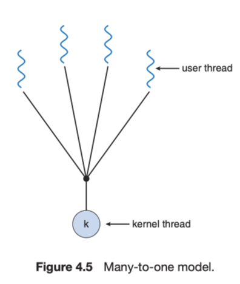
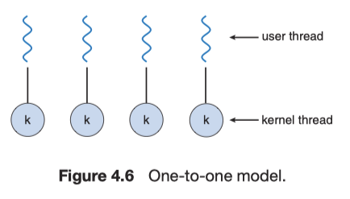
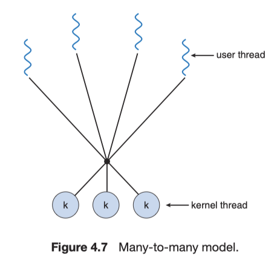

# Chapter 4. 스레드

**스레드**: CPU 이용의 기본 단위로, 스레드 ID, 프로그램 카운터, 레지스터 집합, 스택 으로 구성됨. 같은 프로세스 내의 다른 스레드와 코드, 데이터 섹션, 열린 파일, 신호 같은 운영체제 자원을 공유함.

## 4.1 장점

1. **응답성**: 응용 프로그램의 일부분이 봉쇄되거나, 긴 작업을 수행하더라도 프로그램의 수행이 계속되게 허용함으로써, 사용자에 대한 응답성을 증가시킴. (시간이 오래 걸리는 연산을 별도의 스레드에서 수행)
2. **자원 공유**: 프로세스는 공유 메모리와 메시지 전달 기법을통해서만 자원을 공유. (한 응용 프로그램이 같은 주소 공간 내에 여러 개의 다른 작업을 하는 스레드를 가질 수 있음)
3. **경제성**: 프로세스 생성을 위해 메모리와 자원을 할당하는데 필요한 비용에 비해, 스레드는 자신이 속한 프로세스의 자원들을 공유하기 때문에 훨씬 경제적.
4. **규모 적응성**: 다중 처리기 구조에서 각각의 스레드가 다른 처리기에서 병렬로 수행될 수 있음. (자세한 내용은 챕터 5 참조)

## 4.2 다중코어 프로그래밍

- **다중 코어 시스템**: 코어가 여러 CPU 칩 형태를 띠거나 칩 안에 여러 개가 존재하는 시스템.
- **다중 스레드 프로그래밍**: 다중 코어를 더 효율적으로 사용할 수 있고, 병행 실행을 더 향상시킬 수 있는 기법을 제공.

<aside>
💡 **병렬 실행 vs 병행 실행**

병렬 실행: 하나 이상의 태스크를 동시에 수행. (실제로 여러 작업을 동시에 실행)

병행 실행: 모든 태스크를 번갈아 진행 함으로써 하나 이상의 태스크를 수행. (컴퓨터가 여러 일을 마치 동시에 하듯이 수행)

</aside>

**다중코어 시스템을 프로그래밍하기 위한 5개의 극복해야 할 도전 과제:**

- **테스크 식별**: 응용을 분석하여 독립된 병행기능 태스크로 나눌 수 있는 영역을 찾는 작업이 필요.
- **균형**: 병렬로 실행될 수 있는 태스크를 찾아 전체 작업에 균등한 기여를 가지도록 태스크로 나누어야 함.
- **데이터 분리**: 응용이 독립된 태스크로 나누어지는 것처럼, 태스크가 접근하고 조작하는 데이터 또한 개별 코어에서 사용할 수 있도록 나누어야 함.
- **데이터 종속성**: 태스크가 접근하는 데이터는 둘 이상의 태스크 사이에 종속성이 없는지 검토되어야 함.
- **시험 및 디버깅**: 프로그램이 다중코어에서 병렬로 실행될 때, 병행 프로그램을 시험하고 디버깅.

**병렬 실행의 유형**

- **데이터 병렬 실행**: 동일한 데이터의 부분집합을 다수의 계산 코어에 분배한 뒤 각 코어에서 동일한 연상을 실행. (ex. 배열 덧셈시 0 ~ n/2-1은 1번 스레드에서, n/2-1 ~ n-1 까지는 2번 스레드에서 작업을 수행)
- **태스크 병렬 실행**: 데이터가 아닌 태스크(스레드)를 다수의 코어에 분배. (ex. 1번 스레드에서는 배열 덧셈, 2번 스레드에서는 배열 곱셈 수행)

## 4.3 다중 스레드 모델

- 스레드를 위한 자원은 사용자 와 커널스레드로 나뉜다.
- 사용자 스레드는 커널 위에서 지원되며 커널의 지원 없이 관리 된다.
- 커널 스레드는 운영체제에 의해 직접 지원되고 관리된다.

**n:1 모델**

- 많은 사용자 수준 스레드를 하나의 커널 스레드로 사상.
- 스레드 관리는 사용자 공간의 스레드 라이브러리에 의해 행해진다. 따라서 효율적이라 할 수 있음.
- 한 스레드가 블로킹 시스템을 호출할 경우 전체 프로세스가 블로킹이 일어남.
- 한번에 하나의 스레드만이 커널에 접근할 수 있어 멀티 스레드가 멀티코어 시스템에서 병렬로 실행될 수 없음.
- 아무럿 이점이 없어 거의 사용되지 않음.

**1:1 모델**

- 하나의 사용자 스래드를 하나의 커널 스레드로 사상.
- 이 모델은 하나의 스레드가 블로킹 시스템을 호출하더라도 다른 스레드가 실행될 수 있기 때문에 다대일 모델보다 더 많은 병렬성을 제공.
- 사용자 수준 스레드를 생성할때 커널 스레드를 생성해야하는 점이다. 그래서 오버헤드를 가짐.
- 이 모델의 구현은 시스템에 의해 지원되는 스레드 수를 제한.
- 윈도우와 Linux가 이 모델을 사용.

**n:n 모델**

- 여러개의 사용자 수준 스레드를 그보다 작은 수 혹은 같은 수의 커널 스레드로 멀티플렉싱(multuplex).
- 다대일 모델은 개발자가 원하는 만큼의 사용자 수준 스레드를 생성하도록 허용.
- 그러나 한번에 하나의 스레드만이 커널에 의해서 스케줄 되기 때문에 진정한 병렬 실행을 획득할 수 없음.
- 일대일 모델은 더 많은 동시 실행을 제공하지만 개발자가 한 어플리케이션 내에 너무 많은 스레드를 생성하지 않도록 주의 필요.
- 다대다 모델은 이러한 두가지의 단점들을 어느정도 해결. 개발자는 필요한 만큼 스레드를 생성할수 있다. 또한 커널 스레드가 다중 프로세서에서 병렬로 수행.

## 4.4 스레드 라이브러리

- 비**동기 스레딩:** 부모가 자식 스레드를 생성한 후 부모는 자신의 실행을 재개하여 붐와 자식 스레드가 병행하게 실행됨. (각 스레드는 다른 모든 스레드와 독립적으로 수행)
- **동기 스레드**: 부모 스레드가 하나 이상의 자식 스레드를 생성하고 자식 스레드 모두가 종료할 때까지 기다렸다가 자신의 실행을 재개. (포크-조인 전략)

## 4.5 암묵적 스레딩

- 다중코어 처리의 지속적 성장에 따라 수백 또는 수천 개의 스레드를 가진 응용이 등장하게 됨.
- 이러한 어려움들을 극복하기 위한 한가지 방법은, 스레딩의 생성과 관리 책임을 응용 개발자로부터 컴파일러와 실행시간 라이브러리에게 넘겨주는 것. (**암묵적 스레딩**)

**스레드 풀**

- 매 요청마다 스레드를 새로 생성하고, 스레드를 무한정 생성할 수 있는 문제를 해결하기 위해 사용.
- 프로세스를 시작할 때 아예 일정한 수의 스레드들을 미리 풀로 만들어두는 것.
- 이 스레드들은 평소에는 하는 일 없이 일감을 기다리는 상태.
- 한 개의 요청이 들어오면 이 풀에서 한 스레드에게 작업을 할당.
- 처리가 완료되면 다시 풀로 돌아가 다음 작업을 기다림.
- 스레드 풀의 장점
    - 새 스레드를 만들어 주기보다 기존 스레드로 서비스해 주는 것이 더 빠름.
    - 스레드 풀은 임의 시각에 존재할 스레드 개수에 제한을 둠. 이러한 제한은 많은 수의 스레드를 병행 처리할 수 없는 시스템에 도움이 됨.
    - 태스크와 무관하게 태스크를 생성할 수 있어 태스크를 실행할 때 다양한 전략을 사용할 수 있음. (ex. 태스크를 일정 시간 후에 실행, 태스크를 스케줄하거나 주기적으로 실행)
- 동적으로 풀의 크기를 변경할 수 있음.

**OpenMP**

- C, C++ 또는 FORTRAN으로 작성된 API와 컴파일러 디렉티브의 집합.
- 공유 메모리 환경에서 병렬 프로그래밍을 할 수 있도록 도움을 줌.

**Grand Central Dispatch**

- Apple의 Mac OS X와 IOS 운영체제를 위한 기술.
- C언어, API 및 실행시간 라이브러리 각각을 확장하여 조합한 기술.
- 개발자가 병렬로 실행될 수 있는 영역을 식별할 수 있게 도움을 줌.
- OpenMP처럼 스레딩의 상세 구현의 대부분을 관리.

## 4.6 스레드와 관련된 문제들

**fork()와 exec() 시스템 호출**

- 다중 스레드 프로그램에서는 fork()와 exec()의 의미가 달라질 수 있음.
- 몇몇 UNIX 기종은 **fork()**를 호출하면 (1)새로운 프로세스는 모든 스레드를 복제 하거나, (2)한 개의 스레만 가지는 프로세스를 생성하는 방법 두 가지를 전부 제공.
- 어떤 스레드가 **exec()** 시스템 호출을 부르면 exec()의 매개변수로 지정된 프로그램이 모든 스레드를 포함한 전체 프로세스를 대체.

**신호 처리**

- 신호는 UNIX에서 프로세스에게 어떤 사건이 일어났음을 알려주기 위해 사용됨.
- 손호는 알려줄 사건의 근원지나 이유에 따라 동기식 또는 비동기식으로 전달될 수 있음.
- 모든 신호는 다움과 같은 형태로 전달
    - 신호는 특정 사건이 일어나야 생성됨.
    - 생성된 신호가 프로세스에게 전달됨.
    - 신호가 전달되면 반드시 처리되아야 함.

- 시그널이 실행중인 프로세스 외부로 부터 발생되면 그 프로세스는 시그널을 비동기식으로 전달 받음.
- 이러한 시그널의 예는 Ctrl+C와 같은 특수키를 눌러서 프로세스를 강제 종료시키거나 타이머가 만료되는 경우를 포함.
- 모든 신호는 둘 중 하나의 처리기에 의해 처리됨.
    - **디폴트 신호 처리기**: 모든 신호마다 커널이 이 처리기를 실행.
    - **사용자 정의 신호 처리기**: 디폴트 신호 처리기를 대체하여 신호를 처리하기 위해 호출될 수 있음.

- 단일 스레드 프로그램에서의 신호는 항상 프로세스에게 전달됨.
- 그러나 프로세스가 여러 스레드를 가지고 있는 다중 스레드 프로그램에서의 신호 처리는 다음중 하나의 방법으로 전달됨
    - 신호가 적용될 스레드에게 전달.
    - 모든 스레드에게 전달.
    - 몇몇 스레드들에게만 선택적으로 전달.
    - 특정 스레드가 모든 신호를 잔달받도록 지정.
- 동기식 시그널은 그 시그널을 야기한 스레드에게 정확하게 전달되야 함.
- 비동기식 시그널은 Ctrl+C같은 키를 입력하면 그 프로세스 내의 모든 스레드에게 전달해야 함.

**취소**

- 스레드가 끝나기 전에 강제 종료시키는 작업을 말함. (ex. DB검색중 하나의 스레드가 결과를 찾으면 나머지 스레드 취소)
- 목표 스레드(취소되어야할 스레드)의 취소는 두 가지 방식으로 발생 가능
    - **비동기식 취소**: 한 스레드가 즉시 목표 스레드를 강제 종료
    - **지연 취소**: 목표 스레드가 주기적으로 자신이 강제 종료되어야 할지를 점검.

**스레드 로컬 저장소**

- 한 프로세스에 속한 스레드들은 그 프로세스의 데이터를 모도 공유함.
- 그러나 상황에 따라서는, 각 스레드가 자기만 엑세스할 수 있는 데이터를 가져야 할 필요가 있는데, 그러한 데이터를 **스레드 로컬 저장소(TLS)**라고 부름.
- TLS는 각 스레드마다의 고유한 식별자 정보를 저장.
- TLS는 지역 변수와 달리 함수 호출 전후에도 접근할 수 있음.

**경량 프로세스 (LWP)**

- 스레드 라이브러리와 커널의 통신 문제를 해결하기 위해 사용하는 자료구조. 시용자와 커널 스레드 사이에 위치함.
- 각 LWP는 하나의 커널 스레드에 부속되어 있으며 물리 처리기에서 스케줄 하는 대상이 바로 이 커널 스레드.

**스케줄러 액티베이션**

- 사용자 스레드 라이브러리와 커널 스레드 간의 통신 방법 중의 하나.
- 커널은 응용 프로그램에 LWP의 집합을 제공하고 응용 프로그램은 사용자 스레드를 가용한 LWP로 스케줄.